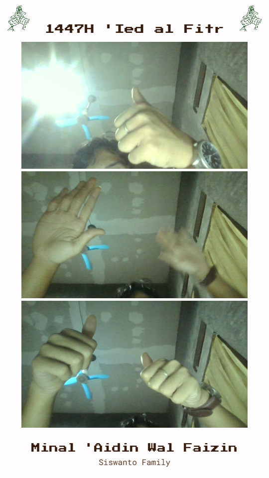

# Cheese! Eid Al Fitr 1447H

A modern, interactive photobooth application for capturing and composing Eid Al Fitr celebration moments. This web-based photobooth automatically captures three consecutive photos with customizable filters and composes them into a beautifully formatted final image.

---

## 📸 Project Preview

<div align="center">
  
  <p><em>Sample output showing three captured photos with Eid Al Fitr styling and decorations</em></p>
</div>

---

## Table of Contents

- [Features](#features)
- [Technology Stack](#technology-stack)
- [Prerequisites](#prerequisites)
- [Installation](#installation)
- [Usage](#usage)
- [Project Structure](#project-structure)
- [API Endpoints](#api-endpoints)
- [Configuration](#configuration)
- [License](#license)

## Features

- 🎥 **Automatic Triple Photo Capture**: Captures three consecutive photos with individual 5-second countdowns
- 🎨 **Real-time Filter Effects**: Apply adjustable Teal & Orange filter intensity to photos
- 💾 **Auto-save to Local Storage**: Photos are automatically saved to disk:
  - **Raw Photos**: Individual unprocessed images with timestamp-based filenames
  - **Final Composition**: Complete photobooth layout with decorative elements and text
- 📐 **Smart Image Cropping**: Intelligent crop and zoom to fit aspect ratios perfectly
- 🎭 **Customizable Layout**:
  - Decorative ketupat (rice cake) graphics
  - Eid Al Fitr greeting text
  - Family/group name display
  - Personalized greetings
- 🔄 **Real-time Preview**: Instant preview of captured photos and final composition
- 🎬 **Full Responsive Design**: Works seamlessly on various screen sizes

## Technology Stack

- **Frontend**: HTML5, CSS3, JavaScript (Vanilla)
- **Backend**: Node.js, Express.js
- **APIs**: Canvas API, MediaStream API, Fetch API
- **File Management**: Multer, Node.js fs module

## Prerequisites

- Node.js (v14 or higher)
- npm (Node Package Manager)
- Modern web browser with:
  - Webcam access
  - Canvas support
  - ES6 JavaScript support

## Installation

1. **Clone the repository:**
   ```bash
   git clone https://github.com/yourusername/cheese-eid-al-fitr-1447h.git
   cd cheese-eid-al-fitr-1447h
   ```

2. **Install dependencies:**
   ```bash
   npm install
   ```

3. **Ensure required directories exist:**
   ```bash
   mkdir -p raw booth assets
   ```

4. **Add ketupat decoration image:**
   - Place your `ketupat.png` image in the `assets/` folder
   - Recommended size: 256x256px or larger

## Usage

### Starting the Application

1. **Start the backend server:**
   ```bash
   npm start
   ```
   
   The server will launch on `http://localhost:3000`

2. **Open in your browser:**
   ```
   http://localhost:3000
   ```

3. **Grant camera permissions** when prompted

### Capturing Photos

1. Click **"Ambil 3 Gambar Otomatis"** (Capture 3 Photos Automatically)
2. First photo countdown starts (5 seconds)
3. Photo is captured and automatically saved to `./raw/`
4. Countdown repeats for photos 2 and 3
5. Final composition is automatically generated

### Saving Final Photo

1. After all three photos are captured, click **"Simpan Gambar"** (Save Photo)
2. Final composed image is saved to `./booth/` folder
3. Confirmation message displays the saved filename

### Adjusting Filters

Use the **"Teal & Orange Filter Intensity"** slider to customize the photo filter (0-100 scale)

### Reset

Click **"Reset Pengambilan Gambar"** to clear all photos and start over

## Project Structure

```
Cheese! Ied Al Fitr 1447H/
├── assets/
│   └── ketupat.png              # Decorative element
├── raw/                         # Individual raw photos (auto-created)
├── booth/                       # Final composed photos (auto-created)
├── index.html                   # Main HTML file
├── style.css                    # Styling
├── script.js                    # Frontend JavaScript logic
├── server.js                    # Express.js backend server
├── package.json                 # Project dependencies
├── package-lock.json            # Locked dependencies
└── README.md                    # This file
```

## API Endpoints

### POST `/api/save-raw-photo`

Saves individual raw photo to the `raw/` folder.

**Request Body:**
```json
{
  "imageData": "data:image/png;base64,...",
  "filename": "photo_1710945600000_1.png"
}
```

**Response:**
```json
{
  "success": true,
  "message": "Raw photo saved",
  "filePath": "C:\\...\\raw\\photo_1710945600000_1.png"
}
```

### POST `/api/save-final-photo`

Saves the final composed photobooth image to the `booth/` folder.

**Request Body:**
```json
{
  "imageData": "data:image/png;base64,..."
}
```

**Response:**
```json
{
  "success": true,
  "message": "Final photo saved",
  "filename": "booth_1710945600000.png",
  "filePath": "C:\\...\\booth\\booth_1710945600000.png"
}
```

## Configuration

### File Naming Convention

- **Raw Photos**: `photo_[TIMESTAMP]_[PHOTO_NUMBER].png`
  - Example: `photo_1710945600000_1.png`
- **Final Photos**: `booth_[TIMESTAMP].png`
  - Example: `booth_1710945600000.png`

### Customizable Settings (in `script.js`)

```javascript
const MAX_PHOTOS = 3;                    // Number of photos to capture
const KETUPAT_IMAGE_PATH = 'assets/ketupat.png';
const ketupatSize = finalCanvas.width * 0.10;  // Decoration size
```

### Canvas Dimensions

Default: `540px × 960px` (9:16 aspect ratio)

Modify in `index.html`:
```html
<canvas id="finalCanvas" width="540" height="960"></canvas>
```

## System Requirements

- **RAM**: Minimum 512MB
- **Disk Space**: ~50MB for installation and dependencies
- **Internet**: Required for initial npm package installation only
- **Webcam**: USB or built-in webcam required

## Troubleshooting

| Issue | Solution |
|-------|----------|
| Server won't start | Ensure port 3000 is not in use. Run `npx kill-port 3000` |
| Photos not saving | Verify `raw/` and `booth/` folders exist and have write permissions |
| Camera access denied | Check browser permissions for camera access |
| Images appear blurry | Ensure good lighting and camera is properly focused |
| Filter not applying | Check filter intensity slider is not at 0 |

## Browser Compatibility

| Browser | Support | Notes |
|---------|---------|-------|
| Chrome/Chromium | ✅ Full | Recommended |
| Firefox | ✅ Full | Good support |
| Safari | ✅ Full | iOS 14.5+ required |
| Edge | ✅ Full | Compatible |
| IE 11 | ❌ Not supported | Legacy browser |

## Performance Tips

- Use good lighting for better photo quality
- Close unnecessary browser tabs for optimal performance
- Clear browser cache if experiencing lag
- Ensure webcam drivers are up-to-date

## Contributing

Contributions are welcome! Please feel free to submit a Pull Request.

## License

This project is licensed under the MIT License - see the LICENSE file for details.

## Authors

- **Bex Project Team** - Initial development

## Acknowledgments

- Inspired by traditional Eid celebrations and modern photobooth technology
- ketupat design elements for festive atmosphere
- Express.js community for excellent documentation

## Contact & Support

For issues, questions, or suggestions, please open an issue on GitHub.

---

**Last Updated**: March 2026  
**Version**: 1.0.0  
**Status**: Active
